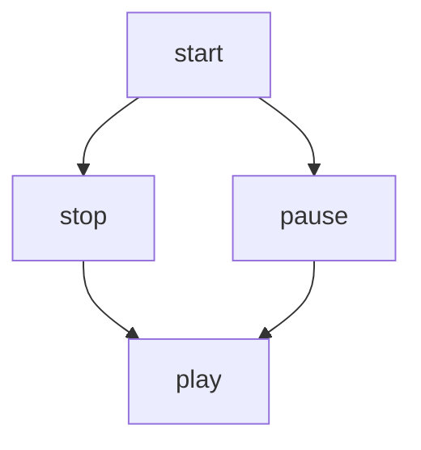

# Extra Styles

==highlight==

~~Strikethrough~~

H~2~o

x^Y^Z

---

Sentence with footnote [^1]

[^1]: Footnote

GitHub Flavoured Markdown, dropdown section

The Summary to show

Some other information

Maps, 
3D,
Mathematical equations,
Quicklinks,
SHAs,
Tasklisks turned to issues,

